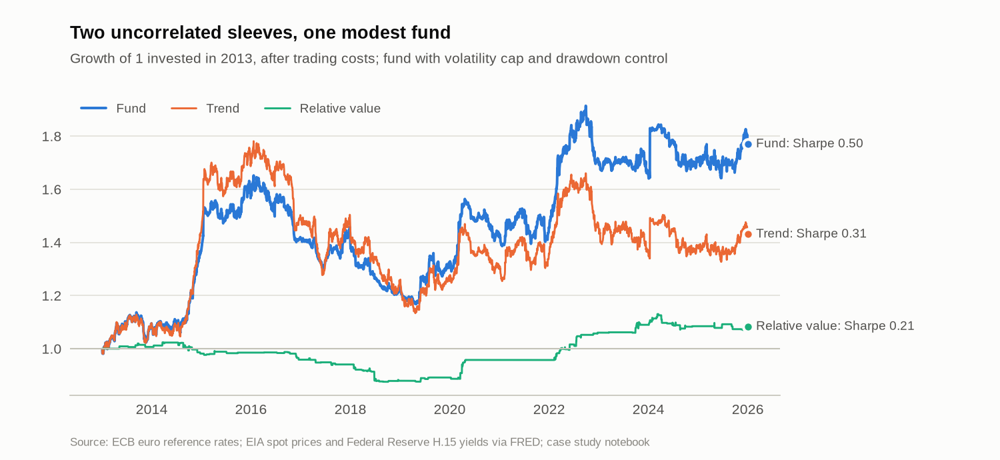
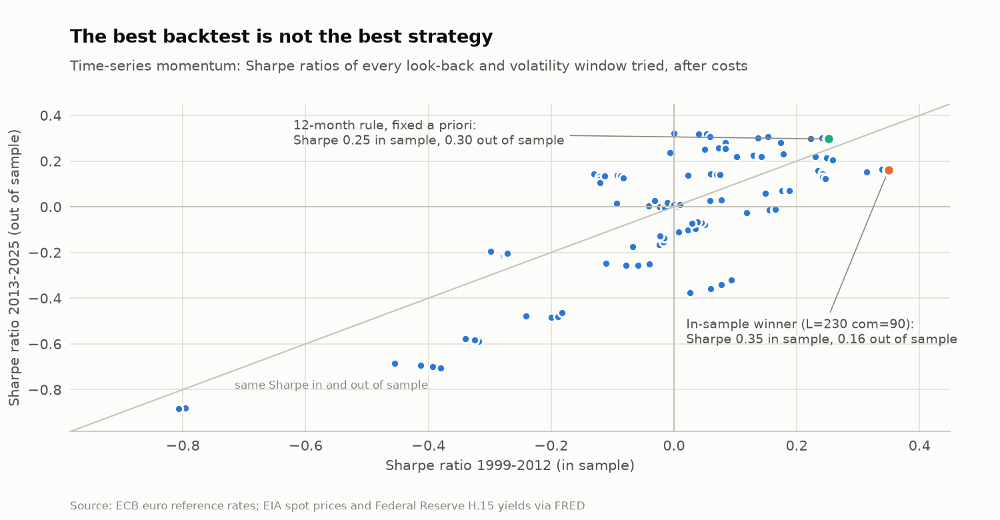
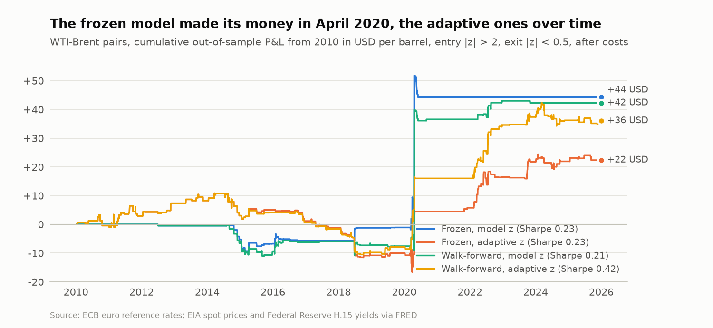
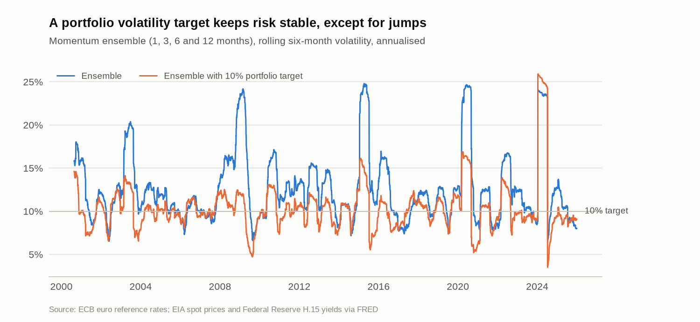
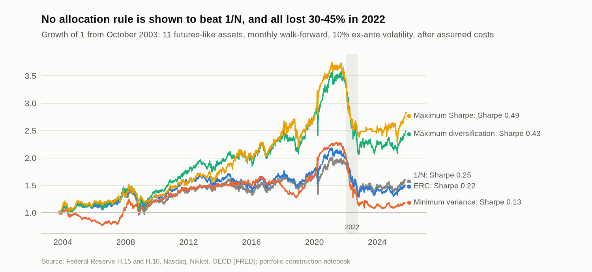
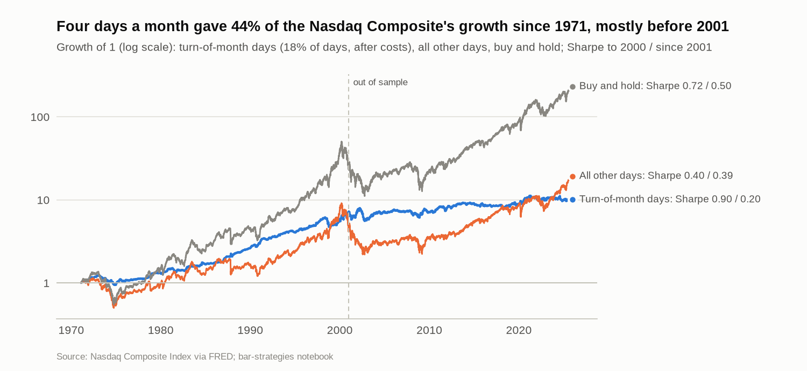
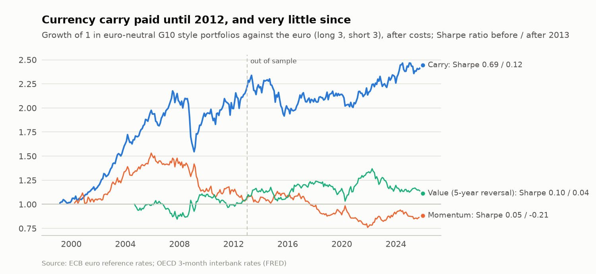

# Algorithmic Trading

[](https://github.com/paolo993788/Algorithmic-trading/actions/workflows/ci.yml)


**Systematic strategy research with a C++17 backtesting engine driven from Python notebooks: no look-ahead, explicit costs and execution lags, walk-forward estimation, overfitting diagnostics and an investment-committee style go/no-go decision, on official ECB, EIA and FRED data; and a bar engine with NinjaTrader's execution model that turns a validated rule into a NinjaScript strategy whose platform trades reconcile with the backtest.**

Most backtests look good because of what they leave out: the configurations that were tried and discarded, the costs, the one-day delay between signal and trade, the single episode that made all the money. This repository puts those elements at the centre. The C++ engine runs parameter grids, combinatorially symmetric cross-validation and bootstraps in parallel; the notebooks use them to answer the questions a portfolio manager, a risk function or an allocator would ask before putting capital behind a strategy.

## Highlights

Results on official data (ECB euro reference rates, EIA spot prices, Federal Reserve Treasury yields and exchange rates, OECD interest rates, and the Nasdaq and Nikkei indices via FRED, up to December 2025), after transaction costs; daily strategies trade with a one-day execution lag, the currency portfolios at month-ends, the allocation rules the day after each month-end. Momentum uses eight instruments: four currencies against the euro, WTI, Brent, Henry Hub and a 10-year US Treasury total-return index.

| Area | What is done | Key result |
| --- | --- | --- |
| Investment committee (case study) | Two-sleeve fund (trend + relative value) with volatility budgets, a fund volatility cap and drawdown control; VaR/ES, Basel traffic-light VaR backtest, stress tests, deflated Sharpe ratio, go/no-go against criteria fixed in advance | Sharpe ratio 0.50 in 2013-2025 with uncorrelated sleeves (correlation -0.01), but a bootstrap interval from -0.09 to 1.07, a deflated Sharpe ratio of 0.31 after 184 research trials and a 29% drawdown: **no-go**, with the limits a pilot would need |
| Currency style premia (case study) | Carry, momentum and value in nine G10 currencies against the euro with OECD interest rates, after costs; Fama UIP regressions; crash risk against the VIX; volatility-targeted, variance-managed and VIX-filtered carry; risk-balanced combination; 54-configuration grid, PBO and deflated Sharpe ratio; go/no-go against criteria fixed in advance | Carry earned 3.3% a year (Sharpe 0.45) with crash risk (-11.2% in October 2008, -0.17% per VIX point), but its Sharpe ratio fell from 0.69 before 2013 to 0.12 after; momentum lost money and value was flat; volatility management helped only in sample; the in-sample grid winner fell from 0.39 to 0.01 (PBO 0.34): **no-go** for carry and for the combination |
| Statistical arbitrage | WTI-Brent pairs on EIA spot prices (not tradable futures; see Roadmap) with a Kalman hedge ratio, grid search, walk-forward re-estimation and an adaptive z-score | The in-sample winner earns a Sharpe ratio of 0.18 out of sample, and -0.12 without April-May 2020; frozen hyperparameters leave the signal miscalibrated (standard deviation of z 2.4 instead of 1); walk-forward re-estimation with an adaptive z raises the out-of-sample Sharpe ratio to 0.42 (0.30 without the 2020 episode) |
| Trend following | Time-series momentum on currencies and energy spot prices (futures returns would add roll yield; see Roadmap), 104-configuration robustness grid, horizon ensemble, portfolio volatility target | The 12-month rule earns a Sharpe ratio of 0.30 in 2013-2025, while the in-sample grid winner falls from 0.35 to 0.16 (PBO 0.33, deflated Sharpe ratio 0.18); the portfolio volatility target cuts the 10%-90% range of the ensemble's six-month volatility from 15 to 7 points, but overnight jumps (Henry Hub, January 2024) pass through |
| Futures layer (library) | Exchange calendars and NYMEX expiry rules, roll schedules decided from the calendar only, unadjusted, difference- and ratio-adjusted series, tradable excess returns robust to negative prices, roll yield, carry, integer-contract P&L; validated against the Schwartz-Smith two-factor model | Exact identities between adjusted series and tradable returns; a rolled position built with the real WTI calendar earns the model's closed-form risk premium within 4 standard errors; applied to real contracts once contract data are available (EIA API) |
| Strategy validation | White's Reality Check, Hansen's SPA test and the Romano-Wolf stepdown on a joint stationary bootstrap (C++), effective number of trials for the deflated Sharpe ratio, Andrews break test, dependence on single episodes; applied to all 228 configurations of the three grids | No configuration survives: SPA p-values 0.20-0.63 and no Romano-Wolf discovery in any grid, in or out of sample; no momentum configuration beats the 12-month rule fixed in advance; each grid is worth only 5-9 independent trials; the baselines' Sharpe ratios vanish once 5-20 of their best days (5-10 months for carry) are removed |
| Portfolio construction | Eight allocation rules (1/N, inverse volatility, risk parity, minimum variance, maximum diversification, maximum Sharpe with sample or Bayes-Stein means; sample or Ledoit-Wolf covariance) on 11 futures-like assets (Treasuries, equities, currencies), walk-forward with lag, drift and costs at 10% ex-ante volatility; Euler risk and expected-shortfall decomposition, crisis windows, 96-configuration grid tested against 1/N | No rule is shown to beat 1/N: the best (maximum diversification, Sharpe 0.43 against 0.25) has an SPA p-value of 0.06, and 0.15 over all 96 configurations; minimum variance puts 95-96% of its risk in levered Treasuries and lost 45% in 2022; 1/N is 55% currency risk; costs (1-8.5 bp a year) do not decide the ranking |
| Bar strategies and platform deployment | Bar engine (C++) with NinjaTrader 8's historical fill model (stop, limit and market orders filled inside the bar along the platform's assumed path, brackets, sessions, contracts, commissions, slippage); Donchian breakout, RSI(2), opening range breakout and turn-of-the-month rules with NinjaTrader-exact indicators; grids, PBO, deflated Sharpe ratio, SPA and Romano-Wolf; NinjaScript code generation and trade-list reconciliation | On the Nasdaq Composite since 1971 the turn-of-the-month rule (in the market 18% of the days) earned a Sharpe ratio of 0.90 through 2000 and 0.20 since (bootstrap interval -0.19 to 0.57), and none of 20 calendar windows survives the Romano-Wolf correction after 2000; the RSI(2) rule lost money before 2001 and earned a Sharpe ratio of 0.57 since; on a martingale, filling stop orders at the stop price gives the opening range breakout a spurious Sharpe ratio of about 1.2 that two ticks of slippage remove: **the fill convention is part of the strategy** |
| Engineering | pybind11 extension, parallel grids, CSCV and joint bootstraps with thread-independent random streams, Python reference implementations | 141 Python tests with pytest, including explicit no-look-ahead checks for every signal, risk control, roll schedule and order plan, and size and power checks of every statistical test by simulation; 10,683 C++ checks built with warnings as errors and run under AddressSanitizer, UndefinedBehaviorSanitizer and ThreadSanitizer; measured benchmarks; CI on every pull request, including an offline run of every notebook; pinned lock file and recorded data vintages |

These are honest negative-to-modest results: spot prices ignore carry and roll yield, the momentum universe is small and energy-heavy, and a Sharpe ratio of 0.5 needs about 15 years of data to be statistically significant. The value of the repository is the process that reaches those conclusions.

## Charts

<picture>
  <source media="(prefers-color-scheme: dark)" srcset="docs/figures/fund_growth-dark.png">
  
</picture>

<picture>
  <source media="(prefers-color-scheme: dark)" srcset="docs/figures/momentum_overfitting-dark.png">
  
</picture>

<picture>
  <source media="(prefers-color-scheme: dark)" srcset="docs/figures/pairs_variants-dark.png">
  
</picture>

<picture>
  <source media="(prefers-color-scheme: dark)" srcset="docs/figures/volatility_target-dark.png">
  
</picture>

<picture>
  <source media="(prefers-color-scheme: dark)" srcset="docs/figures/portfolio_rules-dark.png">
  
</picture>

<picture>
  <source media="(prefers-color-scheme: dark)" srcset="docs/figures/turn_of_month-dark.png">
  
</picture>

<picture>
  <source media="(prefers-color-scheme: dark)" srcset="docs/figures/fx_styles-dark.png">
  
</picture>

The charts are drawn by `python -m backtest_engine.readme_figures` with the same rules, data and engines as the notebooks (light and dark variants in `docs/figures/`).

## Catalogue

| Item | Question | Data |
| --- | --- | --- |
| [`scripts/backtest_engine`](scripts/backtest_engine/README.md) (library) | Reusable C++/Python engines: Kalman filter, pairs and momentum backtests, parallel grids, CSCV/PBO, stationary bootstrap, walk-forward estimation, portfolio risk controls, VaR/ES and stress tests, futures contracts (calendars, rolls, tradable returns, carry), data-snooping tests (Reality Check, SPA, Romano-Wolf), break tests and purged cross-validation, portfolio construction (Ledoit-Wolf covariance, risk budgeting, minimum variance, maximum diversification and maximum Sharpe, Euler risk decomposition, walk-forward rebalancing with costs), bar engine with NinjaTrader's fill model and platform-ready strategies, NinjaTrader bridge (data files, trade lists, reconciliation, NinjaScript generation) | FRED (EIA, Federal Reserve, Nasdaq, S&P), ECB and EIA API loaders; NinjaTrader exports |
| [`scripts/ninjatrader_strategies`](scripts/ninjatrader_strategies/README.md) | Generated NinjaScript (C#) strategies for NinjaTrader 8, rule for rule the strategies of `backtest_engine.bars`, with the installation, backtest and reconciliation procedure | NinjaTrader historical data |
| [Learning notes](docs/learning/README.md) | Teaching companion: intuition, derivations, code mapping, interview questions and exercises for each module: [futures, rolls and carry](docs/learning/futures/futures_rolls_and_carry.md); [data snooping and multiple testing](docs/learning/statistics/data_snooping_and_multiple_testing.md); [portfolio construction under estimation error](docs/learning/portfolio/portfolio_construction.md); [bar strategies and platform export](docs/learning/execution/bar_strategies_and_platform_export.md) | |
| [Investment committee review of a two-sleeve fund](notebooks/case_studies/multi_strategy_investment_committee.ipynb) | Should the committee launch a fund combining trend and relative value, at what size and under which limits? | ECB reference rates, EIA spot prices |
| [Currency style premia](notebooks/case_studies/fx_style_premia.ipynb) | Should a euro-based fund run a G10 carry, momentum and value overlay, and can risk management tame carry crashes? | ECB reference rates, OECD 3-month rates (FRED), VIX |
| [WTI-Brent statistical arbitrage](notebooks/statistical_arbitrage/wti_brent_kalman_pairs.ipynb) | Is the WTI-Brent spread a tradable mean-reversion opportunity after costs, and how much of the backtest survives out of sample? | EIA spot prices (FRED `DCOILWTICO`, `DCOILBRENTEU`) |
| [Multi-asset time-series momentum](notebooks/trend_following/multi_asset_time_series_momentum.ipynb) | Does trend following work on this universe, how sensitive is it to its parameters, and does an ensemble with a volatility target help? | ECB reference rates, EIA energy prices, Federal Reserve 10-year yield |
| [WTI-Brent cointegration in R](notebooks/r_crosschecks/wti_brent_cointegration_r.ipynb) (R) | Do R's cointegration tests (urca, tseries) confirm the Python Engle-Granger results, and what does the Johansen test add? | EIA spot prices (FRED) |
| [Data snooping and multiple testing](notebooks/strategy_validation/data_snooping_and_multiple_testing.ipynb) | After accounting for every configuration tried, does any momentum, currency or pairs configuration have a positive expected return, which ones, and how much depends on single episodes? | Same sources as the three studies |
| [Portfolio construction under estimation error](notebooks/portfolio_construction/portfolio_construction_under_estimation_error.ipynb) | Does estimating risks, correlations or expected returns beat 1/N out of sample, after costs and at equal ex-ante risk, once every rule and setting tried is accounted for? Where does each rule put its risk, and why did all of them fail in 2022? | Federal Reserve H.15 (Treasury yields, T-bill) and H.10 (exchange rates), Nasdaq Composite, Nikkei 225, OECD 3-month rates, all via FRED; 1999-2025 |
| [Bar strategies and NinjaTrader](notebooks/bar_strategies/bar_strategies_and_ninjatrader.ipynb) | Do breakout, mean-reversion, calendar and opening-range rules earn anything on bars under the platform's own fill model, what survives the search over their parameters, how much of an intraday result is the assumption that stops fill at their price, and does the exported NinjaScript trade the same way? | Nasdaq Composite and S&P 500 closes (FRED); the user's NinjaTrader exports (`data/ninjatrader/`), otherwise synthetic daily and 5-minute bars |

Each notebook states its rules, signal timing, costs and data sources, fixes its random seeds, separates in-sample from out-of-sample periods, counts the configurations tried and ends with an interpretation guide. Figures, tables and the committee memo are written to `outputs/`.

## Architecture

```text
notebooks/  ──►  backtest_engine (Python)                  ──►  backtest_engine._core (C++17, pybind11)
                 data loaders (FRED, ECB)                        Kalman filter, maximum-likelihood objective
                 cointegration tests (ADF, Engle-Granger)        pairs backtest and parallel parameter grids
                 walk-forward Kalman, adaptive z-score           momentum: single horizon, ensemble, portfolio vol target
                 portfolio: vol targeting, drawdown control,     CSCV / probability of backtest overfitting
                 VaR/ES, Basel traffic light, stress tests       stationary bootstrap (thread-independent streams)
                 metrics: PSR, deflated Sharpe ratio
                 currency factors: carry, momentum, value, UIP
                 futures: calendars, rolls, adjusted series, carry, P&L
                 validation: Reality Check, SPA, Romano-Wolf, break test, purged CV   joint stationary bootstrap of many series
                 portfolio construction: Ledoit-Wolf covariance, risk budgeting,
                   min-var, max diversification, max Sharpe (NNLS), Euler risk,
                   walk-forward rebalancing with drift, lag, costs, vol target
                 Schwartz-Smith model (validation laboratory)
                 bars: order plans, NinjaTrader-exact indicators,    bar engine: intrabar fills along the platform's path,
                   Donchian, RSI(2), opening range, turn of month      brackets, sessions, contracts, costs; parallel grids
                 ninjatrader: data files, trade lists, reconciliation,
                   NinjaScript generation  ──►  scripts/ninjatrader_strategies/*.cs  ──►  NinjaTrader 8
```

## Getting started

Requirements: Python 3.10 or later and a C++17 compiler (Visual Studio Build Tools on Windows, Xcode Command Line Tools on macOS, GCC or Clang on Linux). From the repository root:

```bash
python -m venv .venv
source .venv/bin/activate            # Windows PowerShell: .venv\Scripts\Activate.ps1
python -m pip install -r scripts/backtest_engine/requirements.txt
python -m pip install -e scripts/backtest_engine
python -m pytest tests/backtest_engine
```

For the exact versions used by CI, install `scripts/backtest_engine/requirements-lock.txt` instead of `requirements.txt`. The standalone C++ tests, sanitizer builds and benchmarks are described in the [library README](scripts/backtest_engine/README.md#c-unit-tests-sanitizers-and-benchmarks).

Open a notebook in Visual Studio Code (extensions *Python*, *Jupyter* and *C/C++*) and select the `.venv` environment as kernel. Official data are downloaded and cached on first use; set `BACKTEST_ENGINE_DATA_MODE=synthetic` to run offline on simulated data. Details, methods and the full validation table are in the [project README](scripts/backtest_engine/README.md).

The notebooks are stored with the outputs of a full run on official data (September 2026), so tables and charts can be read directly on GitHub; the bar-strategies notebook runs on official index closes and, for the bar sections, on the user's NinjaTrader exports or on labelled synthetic bars. The R notebooks in [`notebooks/r_crosschecks/`](notebooks/r_crosschecks/README.md) recompute the main results with independent R packages; they need R 4.2 or later: run `Rscript notebooks/r_crosschecks/install_packages.R` once and select the **R** kernel.

## Repository layout

```text
.
├── scripts/backtest_engine/   C++ engine (cpp/), Python package, build and dependency files
├── scripts/ninjatrader_strategies/  generated NinjaScript strategies for NinjaTrader 8 and the reconciliation procedure
├── notebooks/                 case_studies/, statistical_arbitrage/, trend_following/, strategy_validation/, portfolio_construction/, bar_strategies/, r_crosschecks/ (R)
├── tests/backtest_engine/     validation suite (pytest)
├── docs/                      learning notes (learning/), README figures, project template, publishing workflow
├── data/                      download cache and NinjaTrader exports (ignored by Git) and small examples
└── outputs/                   generated figures, tables and memos (ignored by Git)
```

## Roadmap

Rebuild the momentum and pairs studies on tradable futures returns with the new futures layer (the spot prices used so far ignore roll yield); risk budgeting by asset class and stressed-correlation tests for the allocation layer; non-linear transaction-cost and market-impact models; emerging-market currencies and a real-exchange-rate value signal; execution cost models calibrated on intraday data; regime detection for the pairs sleeve; live paper-trading monitor with the committee's limits; for the bar engine, NinjaTrader's High fill resolution (signals on one series, fills on a finer one), a Monte Carlo over intrabar paths consistent with each bar, and the parity check against a real Strategy Analyzer export.

## Conventions

- Each project documents its purpose, inputs, outputs and exact run command, following the [project README template](docs/script-template.md).
- Signals use only information available at the decision time; execution lags and transaction costs are explicit parameters, and tests check the absence of look-ahead.
- Parameters are chosen in sample and evaluated out of sample; the number of configurations tried is reported together with overfitting diagnostics.
- Simulations and bootstraps use a fixed, documented random seed.
- Market data is committed only when its license allows redistribution; otherwise, the repository provides the code to download it.
- Paths are relative to the repository root, and no credentials or confidential data are ever committed.

## Development workflow

Changes follow the [publishing workflow](docs/publishing.md). Every pull request runs the [CI workflow](.github/workflows/ci.yml): lint, the Python tests on Python 3.10-3.12, the C++ tests with GCC and Clang and under sanitizers, and every notebook offline on synthetic data. The [`CLAUDE.md`](CLAUDE.md) file provides project instructions for [Claude Code](https://claude.com/claude-code), so that AI-assisted contributions meet the same standards.

## Disclaimer

The code is for research and education. Backtested results are hypothetical, ignore many real-world frictions and are not investment advice.

## License

Released under the [MIT License](LICENSE).
